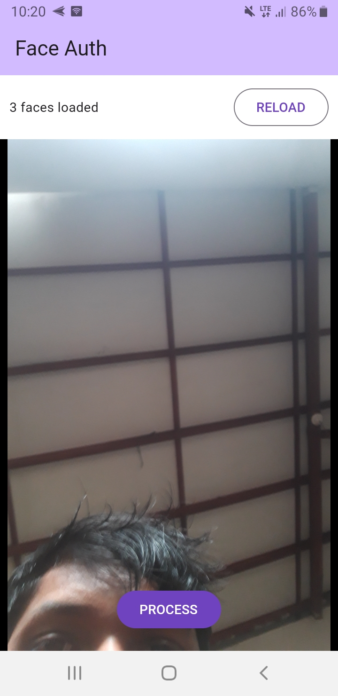

# Face Authentication Application

This is a face authentication application connected to Firebase Firestore for storing face data. It uses the `facenet512` model to handle face recognition.

## Features

- **FaceNet512 Model**: Utilizes the FaceNet512 model to encode facial features.
- **Firebase Firestore Integration**: Stores face data (as a Float32 array of length 512) and corresponding names (as strings) in Firestore.
- **Face Data Loading**: Loads all face data from Firestore upon app launch.
- **Face Data Storage**: Allows users to capture their face and store the data in Firestore.
- **Face Prediction**: Predicts the user's identity by comparing the captured face data with the stored data using cosine similarity.

## How It Works

1. **App Launch**: 
   - On launching the app, it loads all face data from Firebase Firestore.
   
2. **Storing Face Data**:
   - Capture your face through the app.
   - Your face data (a Float32 array of length 512) and your name (a string) are stored in Firestore.

3. **Predicting Identity**:
   - On subsequent uses, the app captures your face and predicts your identity.
   - The prediction is based on cosine similarity between the captured face data and the stored data in Firestore.

## Screenshots

### App Interface

### Predicted Page

### Data Storage in Firestore

## Purpose

This application aims to assist in mobile face authentication purposes, leveraging advanced face recognition technology and cloud storage.

---

I hope this project helps you in implementing mobile face authentication functionalities efficiently.
